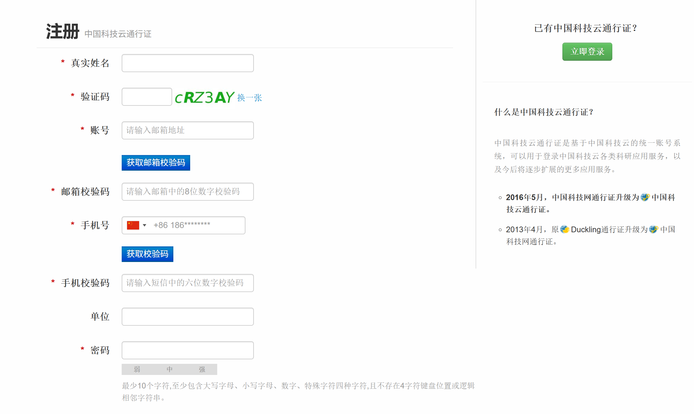
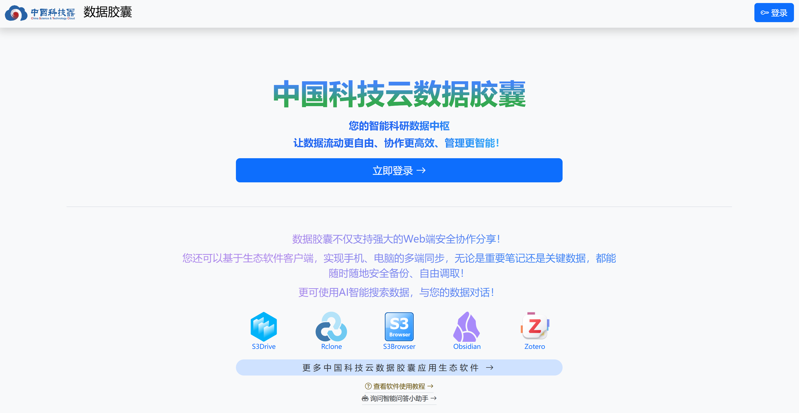
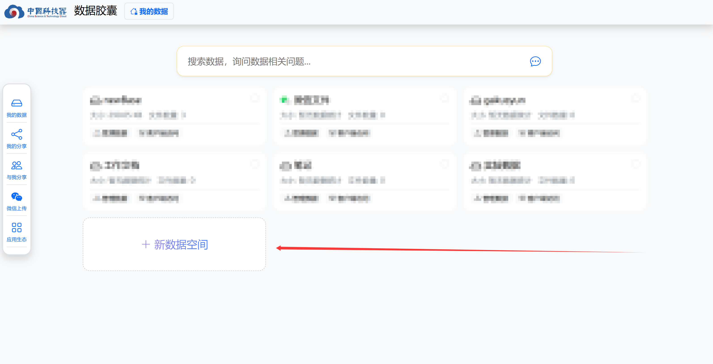
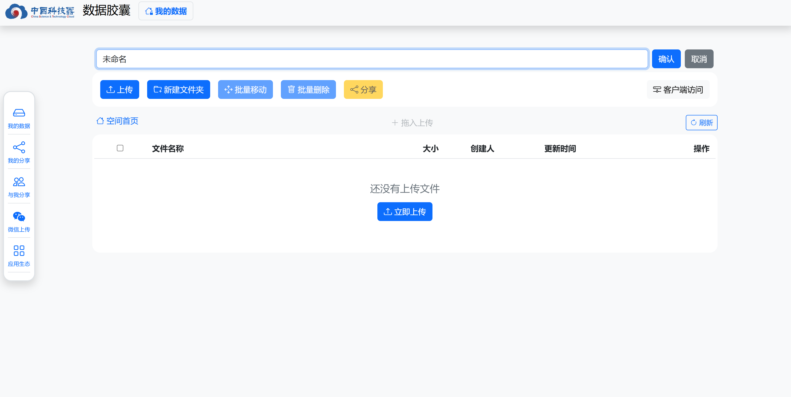
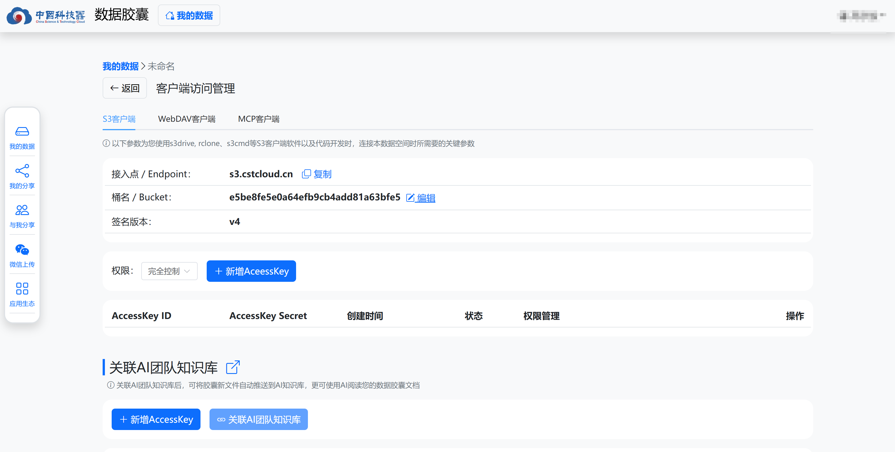
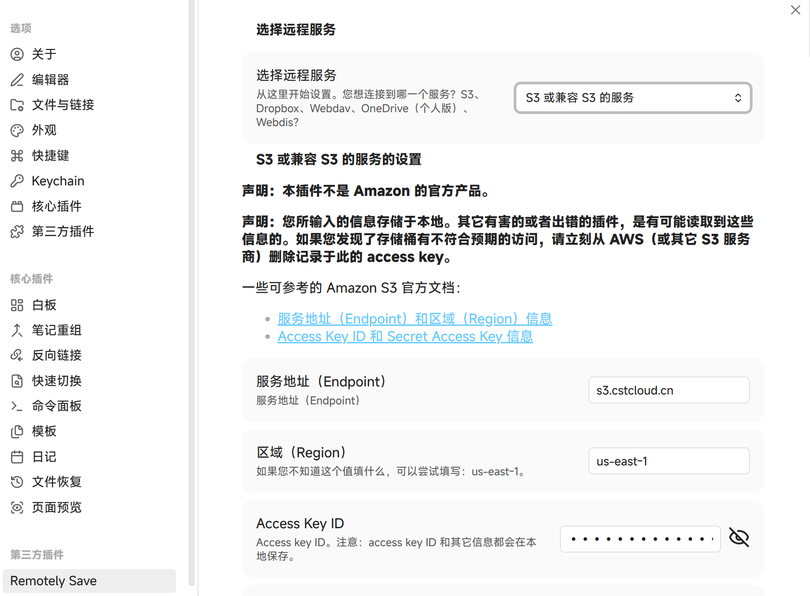

> 本文章使用 Microsoft Copilot GPT-5.2 辅助写作。

前些日子在小红书刷到一篇帖子，吐槽 Overleaf 编译时间超过 10 秒就要收费。在评论区翻了翻，意外得知 **[中国科技云](https://www.cstcloud.cn/)** 提供了一个基于开源版 [Overleaf](https://latex.cstcloud.cn/) 的在线服务，单次编译时间可免费使用 **600 秒**。出于好奇，我顺手探索了一下中国科技云，结果发现它居然还提供了一个 **免费的 20G 存储（兼容 S3）**。

既然有现成的 S3，那不用来同步 Obsidian 就有点说不过去了。于是折腾了一番，用 **Remotely Sync** 插件成功把 Obsidian 接入了中国科技云的 S3。下面简单记录一下过程。

---

# 注册并创建 S3 存储桶

首先[注册](https://www.cstcloud.cn/login)一个中国科技云账号

然后进入 **[数据胶囊](https://data.cstcloud.cn/)** 页面：

进入后，新建一个 **数据空间**：

这里需要注意一点：**“未命名”只是别名，不是实际的桶名称**。

创建完成后，点击 **客户端访问**：
  

在这里可以修改桶名，并创建一个 **AccessKey**，后面配置 Obsidian 时会用到，请妥善保存。

---

# 配置 Obsidian 的 Remotely Sync

接下来切换到 Obsidian。

1. 打开设置 → **第三方插件**
2. 关闭安全模式，搜索并安装 **Remotely Sync**

> 同时也建议在 **核心插件** 中关闭 Obsidian 自带的同步功能，避免冲突。

插件安装完成后，按如下方式填写配置：

- **服务地址（Endpoint）**：`s3.cstcloud.cn`
- **区域（Region）**：`us-east-1`
- **Access Key ID / Access Key**：填写刚才创建的
- **S3 URL Style**：一定要选择 **Path Style**

配置完成后，点击 **检查连接**。

如果一切顺利，就可以看到连接成功的提示了。至此，Obsidian 已经可以通过中国科技云的 S3 实现同步。

---

数据胶囊还支持 WebDAV 访问，也可以使用 WebDAV 接入更多应用。