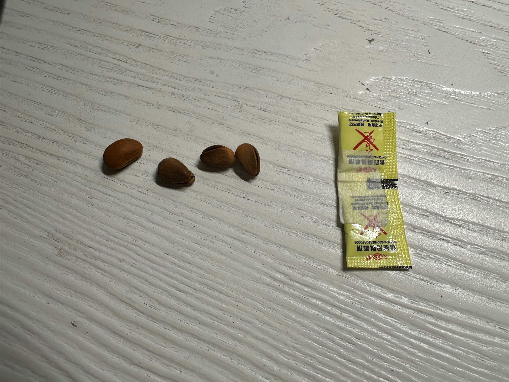
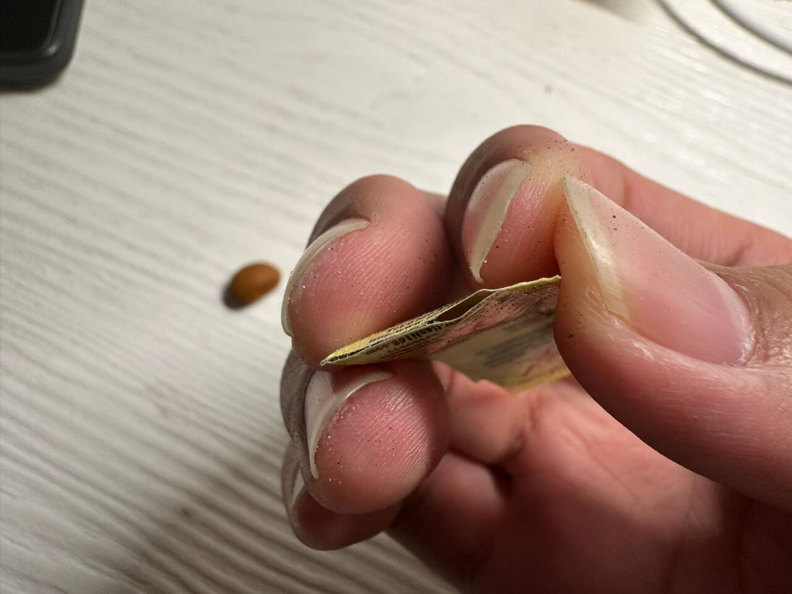
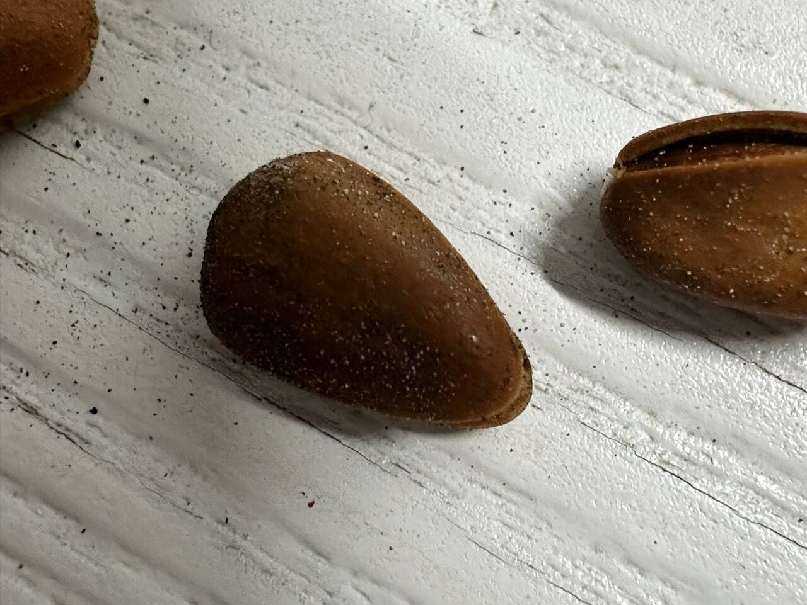

# Intro

2025 年 1 月 20 日 21 时许，我打开了一包`某某某某`产的*长白山松子*准备吃。当我把那包倒出来，我惊奇地发现，居然有两包脱氧剂！

而且，松子表面还有些白的、黑的小颗粒，我以为是析出的食用盐，就没有在意。_~~现在想来，颗粒比食盐颗粒小很多~~_。因为吃瓜子的时候经常出现有很多食盐的，我还挺喜欢吃很多盐的那种。_~~禁止模仿，吃太多食盐不健康~~_。所以我甚至还用手碰了一下松子表面的小颗粒，然后舔了一下，不咸，当时想的是颗粒太小了，而且手上也没粘多少就没在意。然后就打算开心地吃松子。吃了几颗，手上就一股铁锈味，然后就丢了，开另外一包。开了另外一包，看到完整的脱氧剂上下都有封口，猛然想起，刚才的那包脱氧剂好像没封口，才反应过来吃的好像是脱氧剂。然后我翻垃圾桶找到这包脱氧剂，果然已经破损了。

松子上粘的颗粒也确实是脱氧剂的颗粒。

# 客服

于是我就开始找`某某某某`品牌的客服，发了包括上述三张图，订单号，商品的生产日期和手机之后，客服回复我：

> `某某`已为您反馈给售后，预计 24H 内为您电联处理，请您注意接听`某某某`开头的固话，会有专员给您妥善处理的呢~

# 后续

1 月 21 日 9 时 58 分，`某某某某`品牌给我回电，说给我退 69.9 元。购买的价格是 41.9 元。总体处理的还算满意，毕竟我也没怎么样。不过以后是不会买`某某某某`品牌的零食了。
