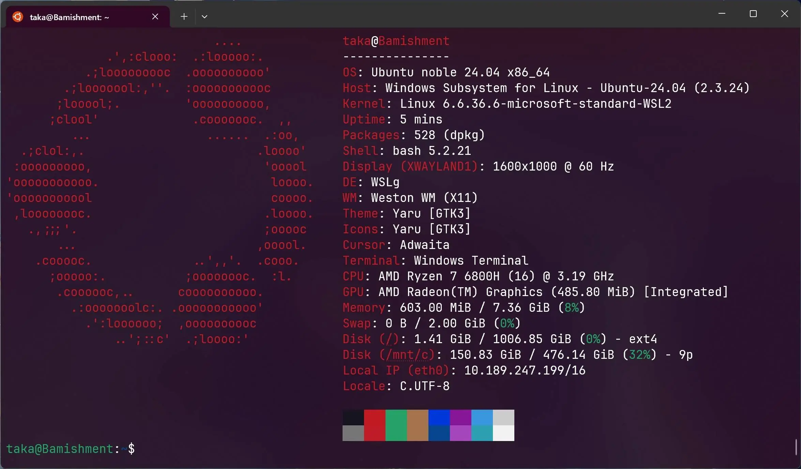
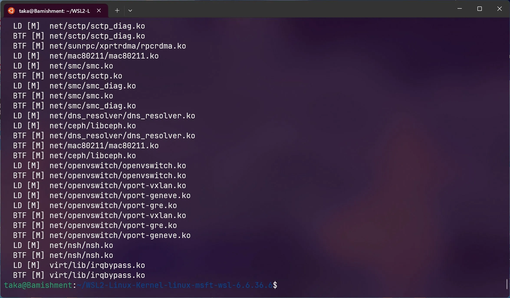

> 注意：此文档已过时，仅作为存档。

WSL2 默认使用的内核是 5.\*，这里为 WSL2 编译最新（编辑时 6.6.36.6）版本内核，以支持更多新特性

- 编译环境：
  - 我们使用 WSL 中的 Ubuntu 发行版
  - 使用命令`sudo apt install build-essential flex bison dwarves libssl-dev libelf-dev cpio`安装编译所需依赖
- 下载内核源码
  - 在[此处](https://github.com/microsoft/WSL2-Linux-Kernel/releases/latest)下载，建议下载 releases 中的压缩包，使用 git clone 命令太慢
  - 解压到任意目录
  - 进入解压后的目录
- 编译内核
  - 使用命令`make KCONFIG_CONFIG=Microsoft/config-wsl`开始编译 - 或者使用`make KCONFIG_CONFIG=Microsoft/config-wsl -j8`调用多线程加速编译

`Mitigations for CPU vulnerabilities (CPU_MITIGATIONS) [Y/n/?] (NEW)` 选 Y

`Analog Devices Generic AXI ADC IP core driver (ADI_AXI_ADC) [N/m/?] (NEW)` 选 n

编译中：

编译过程

编译完成后没有提示

编译完成

编译完成后的文件在 `arch/x86_64/boot` 下，文件名为 bzImage。

可以用命令 `mv arch/x86_64/boot/bzImage mnt/c/kernel` 把编译完的内核文件移动到 C 盘根目录下。
